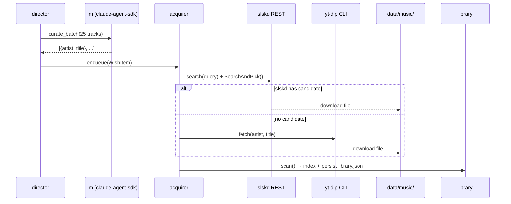
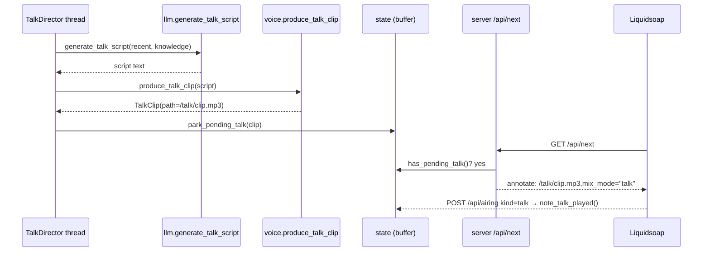
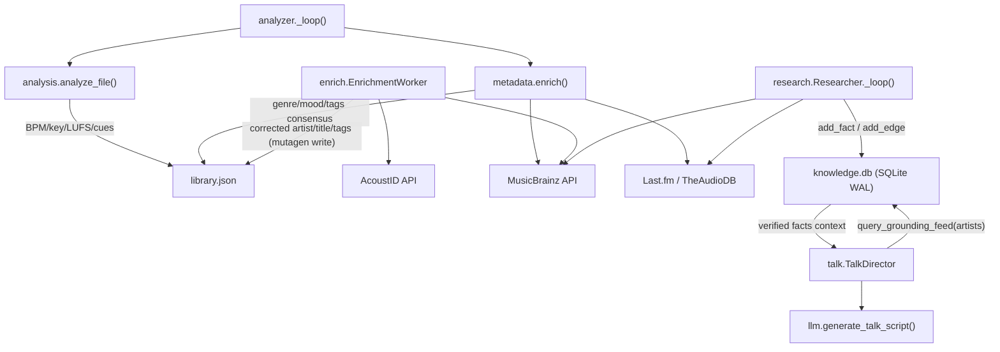

# Data Flow

---

## Path 1: Curation → Acquisition → Library

**Summary**: LLM generates a wishlist of artist/title pairs; acquisition workers download them via Soulseek or yt-dlp; the library indexes the new files.

**Steps**:
1. `director._tick()` checks library watermark (low = `<25 tracks eligible`)
2. `llm.curate_batch(model, batch_size=25, recent, seed_reference)` shells out to `claude-agent-sdk` CLI → returns `[{artist, title}, ...]` (SEED_TRACKS on failure)
3. `director` deduplicates each item against `library.normalize_key()` and `acquire.AttemptsIndex`
4. Survivors → `acquirer.enqueue(WishItem(artist, title))`
5. `acquire` worker pops item; calls `slskd.search(query)` → `SearchAndPick()` → ranked `Candidate`
6. If candidate found: `slskd.download(username, file)` → file written to `data/music/`
7. If no candidate: `ytdlp.fetch(artist, title, music_dir)` — shells out to yt-dlp CLI → file written to `data/music/`
8. `acquire` calls `library.scan()` → mutagen reads new file tags → `Track` added to in-memory index → `library.json` persisted via atomic write
9. `acquire.AttemptsIndex.record(item)` → `attempts.json` updated

---

## Path 2: Playout Pull Path (Liquidsoap → brain → crossfade → Icecast)

**Summary**: Liquidsoap continuously polls `/api/next`; brain returns the next file URI with metadata annotations; Liquidsoap crossfades tracks and streams MP3 to Icecast.

**Steps**:
1. Liquidsoap `request.dynamic.list(prefetch=2, next_track)` calls `next_track()` every ~2s
2. `next_track()` executes `http.get("http://brain:8080/api/next", timeout=6.0)`
3. `server._PickNextHandler.do_GET('/api/next')`: check welcome → check talk cadence → `library.pick_eligible(avoid=state.recent())` → `state.note_committed(key)` → return `annotate: /music/...,artist="…",mix_mode="music"`
4. `request.create(uri)` resolves file path + applies metadata annotations
5. `cross(duration=4.0, width=2.0, transition, source)` evaluates `mix_mode` annotation:
   - `music → music`: `add([fade.out(3.0, old), fade.in(3.0, new)])` (overlapping crossfade) + `insert_metadata(new.metadata)` to preserve tags through merge
   - `music → talk` or `talk → music`: `sequence([old, new])` (clean cut, no overlap)
6. `on_metadata(report_airing)` fires when crossfaded output emits metadata → assembles form body → `thread.run(fast=false, fn)` → POST `http://brain:8080/api/airing` (artist/title/album/kind)
7. `metadata.map(fold_album)` rewrites ICY StreamTitle to `"Artist - Title — Album"`
8. `mksafe(radio)` wraps output: brain stall → ~2–3s silence, no stream abort
9. `output.icecast(%mp3(bitrate=320), host="icecast", port=8000, mount="/radio")` → Icecast serves listeners

```mermaid
sequenceDiagram
    participant LS as Liquidsoap
    participant BRAIN as brain /api/next
    participant CROSS as cross() crossfader
    participant AIRING as brain /api/airing
    participant IC as Icecast :8000/radio
    participant LISTENERS as Listeners

    loop every ~2s (prefetch=2)
        LS->>BRAIN: GET /api/next
        BRAIN-->>LS: annotate: /music/track.mp3,mix_mode="music"
    end
    LS->>CROSS: apply transition (crossfade or sequence)
    CROSS->>AIRING: POST /api/airing (on_metadata, ground truth)
    AIRING-->>BRAIN: state.set_on_air()
    CROSS->>IC: MP3@320kbps stream
    IC-->>LISTENERS: HTTP audio /radio
```

---

## Path 3: Host-Talk Generation

**Summary**: `TalkDirector` watches the songs-since-talk counter; when the cadence threshold is met, it calls the LLM for a script, renders audio via Kokoro/Piper TTS, and parks the clip in `state` for the next `/api/next` call to serve.

**Steps**:
1. `talk.TalkDirector._loop()` runs on its own thread; checks `state.songs_since_talk >= cfg.talk_cadence` (or `state.welcome_owed()`)
2. Calls `llm.generate_talk_script(recent_tracks, knowledge_context, persona)` → script string
3. `voice.produce_talk_clip(script, provider)`:
   a. `KokoroProvider.synthesize(text)` → WAV bytes (or `PiperProvider` fallback)
   b. ffmpeg pipe: WAV → loudness-normalize to `-16 LUFS` → MP3 → write to `cfg.talk_dir/clip_NNN.mp3`
4. `state.park_pending_talk(TalkClip(path, script))` — atomically stores clip path
5. On next `/api/next` call: `state.has_pending_talk()` → true → server returns `annotate: /talk/clip_NNN.mp3,mix_mode="talk"`
6. Liquidsoap plays clip through clean-cut transition (no crossfade)
7. `POST /api/airing` with `kind="talk"` → `state.note_talk_played()` → counter reset

---

## Path 4: Metadata Enrichment and Knowledge

**Summary**: Two parallel background paths run off-axis from playout: (A) the analyzer runs DSP and multi-source metadata consensus on newly-acquired tracks; (B) the researcher fills the knowledge graph with artist facts from external APIs, which the talk director then uses for grounded host scripts.

### 4A — Audio Analysis and Tag Enrichment

**Steps**:
1. `analyzer.Analyzer._loop()` queries `library` for tracks where `analysis_version < SCHEMA_VERSION` or `enrich_version < ENRICH_SCHEMA_VERSION`
2. `analysis.analyze_file(path)`: lazy-import librosa → extract BPM, key, energy, LUFS, cue points, timbre → return dict
3. `metadata.enrich(path)`: query MusicBrainz (1 req/s throttle) + TheAudioDB + Last.fm + embedded tags → consensus(≥2 sources) → genre/mood/tags dict
4. `library.set_analysis(track_id, analysis_dict)` + `library.set_metadata(track_id, meta_dict)` → update in-memory Track + persist library.json
5. `enrich.EnrichmentWorker`: if `track.enrich_version < ENRICH_SCHEMA_VERSION`: AcoustID fingerprint (chromaprint) or MusicBrainz text-match → `Canonical(artist, title, album, year, genre)` → mutagen write-back to audio file tags + library update

### 4B — Knowledge Graph Research

**Steps**:
1. `research.Researcher._loop()` picks artists from `library` not yet in `knowledge` (bounded batch per tick)
2. For each artist: MusicBrainz artist lookup (1 req/s) → biography, formed/disbanded, members, genre, era → `knowledge.add_fact(entity, fact_type, value, source, date)`
3. Wikidata/Last.fm cross-reference → relationship edges → `knowledge.add_edge(entity_a, rel, entity_b, source)`
4. All facts require ≥2 confirmed sources before `knowledge.query_grounding_feed()` returns them
5. `talk.TalkDirector` calls `knowledge.query_grounding_feed(artists=[recent_artists])` → verified facts context dict → passed to `llm.generate_talk_script(knowledge_context=...)` → LLM produces grounded, factually-checked host narration

