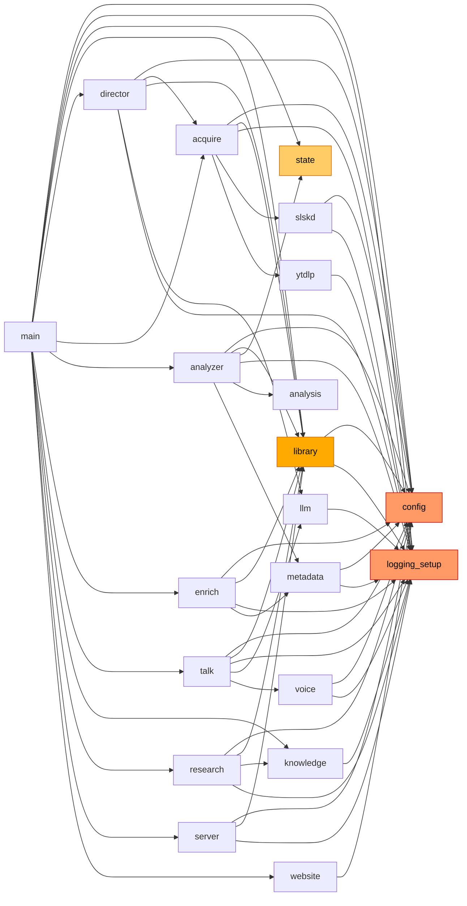

# Dependency Graph

---

## Brain Intra-Package Import Graph

---

## Adjacency List

| Module | Imports (brain-internal only) |
|--------|-------------------------------|
| main | config, logging_setup, state, library, director, acquire, analyzer, enrich, talk, knowledge, research, server, website |
| director | config, acquire, library, llm, logging_setup |
| acquire | config, library, logging_setup, slskd, ytdlp |
| analyzer | config, library, state, logging_setup, analysis, metadata |
| enrich | config, metadata, logging_setup, library |
| research | config, library, knowledge, logging_setup |
| talk | config, library, logging_setup, llm, voice |
| server | config, library, logging_setup |
| library | config, logging_setup |
| slskd | config, logging_setup |
| metadata | config, logging_setup |
| voice | config, logging_setup |
| website | config |
| knowledge | logging_setup |
| llm | logging_setup |
| analysis | _(none)_ |
| ytdlp | logging_setup |
| state | _(none)_ |
| config | _(none)_ |
| logging_setup | _(none)_ |

---

## High Fan-In Hub Modules

| Module | Fan-In (imported by) | Role |
|--------|----------------------|------|
| `logging_setup` | 14 of 20 modules | Universal structured logging; true root leaf — no dependencies of its own |
| `config` | 11 of 20 modules | All subsystem configuration; only imports stdlib |
| `library` | 7 modules (director, acquire, analyzer, enrich, research, talk, server) | Central music index; writer bottleneck for scan+persist |
| `state` | 2 modules (main, analyzer); also read by server at runtime | Ground-truth now-playing and rotation state |

---

## Circular Dependency Analysis

**No circular dependencies detected.**

The import graph is a strict DAG:

- `config` and `logging_setup` are pure leaf nodes imported by everyone — they import nothing internal.
- `state` and `library` are second-tier leaves — they import only `config`/`logging_setup`.
- `director` imports `acquire` and `library`, but neither imports `director`.
- `acquire` imports `library`, but `library` does not import `acquire`.
- `talk` imports `llm` and `voice`, but neither imports `talk`.
- `main` imports everything but is imported by nothing.

The fan-out from `main` is deep but acyclic: `main → director → acquire → slskd` and `main → director → llm` have no back-edges.

---

## Go radiod Internal Dependencies

| Package | Imports (internal/) |
|---------|---------------------|
| main (cmd/radiod) | config, state, store, library, slskd, acquire, director, web |
| director | acquire, library, state |
| acquire | library, slskd, state, store |
| scheduler | library, playout, state |
| web | library, state |
| library | store |
| slskd | _(none)_ |
| state | _(none)_ |
| store | _(none)_ |
| playout | _(none)_ |
| config | _(none)_ |

No circular dependencies in the Go component. `scheduler` is dead code (not imported by main).
