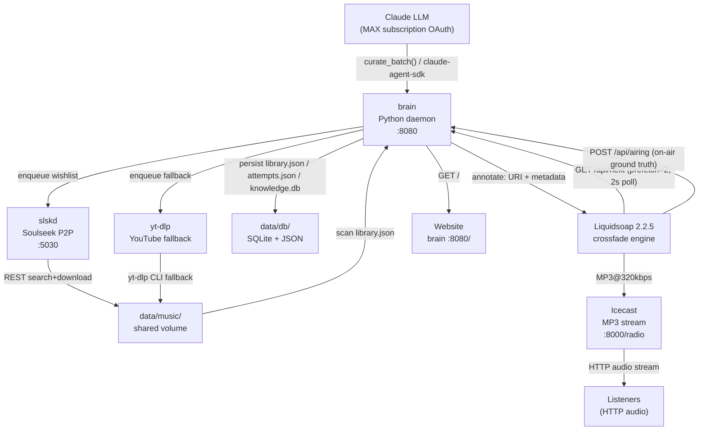

# Golden Shower Radio — Architecture Overview

Golden Shower Radio is an autonomous AI internet radio station: a multi-process pipeline in which a Python AI brain curates music via Claude LLM, acquires tracks through Soulseek P2P (slskd) or yt-dlp, analyzes and enriches metadata offline, pre-renders TTS host-talk clips, and serves a continuous playout stream through Liquidsoap → Icecast — the station never stops, and all editorial decisions are made without human intervention.

---

## Codebase Inventory

### brain/ — Python Station Brain

- **Modules**: 20 Python modules
- **Responsibility**: All runtime intelligence — LLM curation, music acquisition, audio analysis, metadata enrichment, knowledge graph, TTS host voice, HTTP API serving, playout scheduling
- **Pattern**: Multi-threaded modular daemon; background workers (director, acquirer, analyzer, enricher, talk, researcher) isolated from the `<1s` HTTP pull path; graceful degradation throughout

### internal/ (Go radiod) — Alternative Daemon Brain

- **Modules**: 9 Go packages under `internal/`
- **Responsibility**: Pure-stdlib Go alternative to the Python brain; same HTTP pull model, same slskd/yt-dlp acquisition, Claude API-based director, JSON persistence
- **Pattern**: Goroutine-per-subsystem with panic recovery; no external Go dependencies; stdlib only
- **Status**: Exists as an alternative runtime; the Python brain is the primary deployed service

### deploy/ — Playout Infrastructure

- **Components**: Docker Compose stack (brain, liquidsoap, icecast, slskd), `Dockerfile.brain`, `scripts/run.sh`, `deploy/config/radio.liq`
- **Responsibility**: Containerised deployment, Liquidsoap crossfade/transition scripting, Icecast streaming sink, orchestration and health-checking
- **Pattern**: PULL-based playout — Liquidsoap polls brain `/api/next` every ~2s (prefetch=2); brain never pushes to Liquidsoap

---

## Runtime Topology

---

## Architecture Pattern

**PULL-based continuous stream with off-path background enrichment**

The HTTP pull model decouples editorial decisions from playout timing. Liquidsoap holds a 2-item prefetch buffer and tolerates up to 6s of brain latency before falling through to `mksafe` silence (~2–3s). The brain's `/api/next` handler must respond in `<1s`; all enrichment (analysis, metadata, knowledge, TTS) happens in background workers that are never on the critical path.

All subsystems use best-effort exception isolation — no worker failure is allowed to crash the stream. The station's invariant is: _continuous operation above all_.
